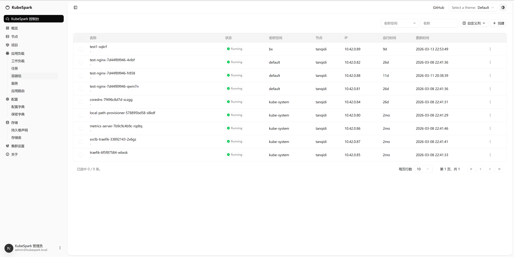
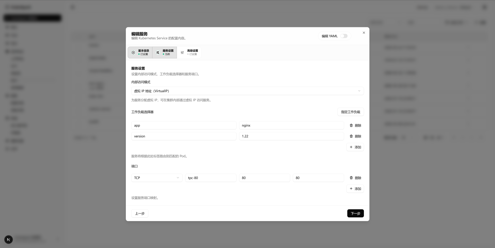
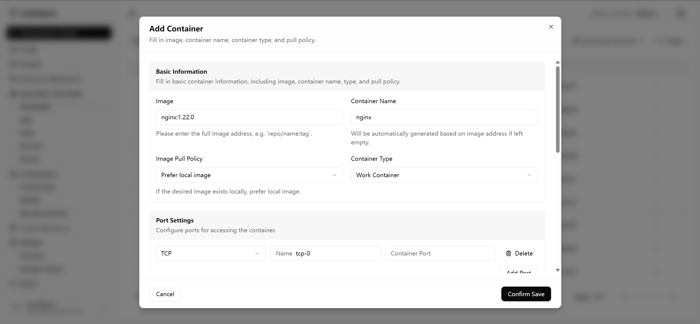
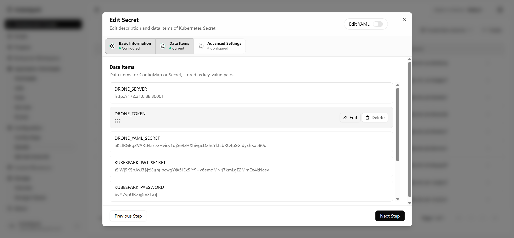
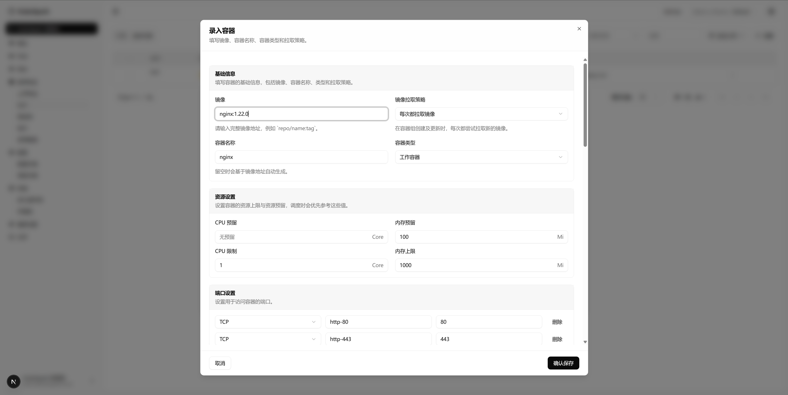

# KubeSpark 控制台（React + Next.js）

KubeSpark 是一个面向 Kubernetes 的可视化管理控制台，聚焦资源 CRUD 与 YAML 协同编辑。  
当前已覆盖命名空间、Pod、Service、Job/CronJob、ConfigMap、Secret 等常见资源的列表管理、创建/编辑与 YAML 查看能力。

## 界面预览







## 核心能力（当前）

### 1. 统一资源管理工作台

- 覆盖 Namespace、Pod、Service、ConfigMap、Secret、Job、CronJob、Ingress、PV/PVC、StorageClass 等常见资源。
- 提供统一列表体验：分页、筛选、轮询刷新、行级操作、批量删除。
- 内置查看 YAML 与删除确认弹窗，满足日常运维闭环。

### 2. 表单 + YAML 双模式协同

- 支持可视化配置与 YAML 查看/编辑切换。
- 在关键创建/编辑流程中，保证“表单输入”和“资源 YAML”之间可互相映射。
- 通过统一校验与错误定位机制（首个错误字段自动滚动聚焦）提升录入效率。

### 3. Service 可视化配置

- 支持 Service 基本信息、访问模式、工作负载选择器、端口映射等配置。
- 兼容常见服务暴露场景，适配应用发布和集群内访问需求。
- 可在弹窗内分步骤完成配置，并结合 YAML 结果核对。

### 4. Job / CronJob 多步骤编排

- 提供多步骤配置流程：基础信息、调度策略、容器组设置、存储设置、高级设置。
- Cron 表达式、重试策略、并发策略等关键字段可视化录入。
- 支持任务创建与 YAML 查看，便于运维排障与配置审计。

### 5. 容器录入能力

- 支持镜像地址、拉取策略、容器类型（工作/初始化）配置。
- 支持 CPU/内存请求与上限配置，端口协议/名称/端口录入。
- 支持环境变量、探针等配置项，满足常规应用部署参数要求。
- 在“至少一个容器”约束下提供前置拦截与警告提示，避免提交无效配置。

### 6. 存储挂载能力（Job / CronJob）

- 支持 PVC、EmptyDir、HostPath 三类卷配置与容器挂载路径设置。
- PVC 下拉读取真实集群数据，不再使用静态示例项。
- 支持完整回显链路：`YAML -> 表单 -> YAML`。
- 兼容用户手写 YAML 的自定义卷名：
  - 保留 `volumes[].name` 作为卷名（`volumeId`）。
  - 保留 `persistentVolumeClaim.claimName` 作为 PVC 名（`volumeName`）。
  - 编辑时不强制改写原有卷名。
- 保存校验按“卷名”维度处理重复，允许“同 PVC、不同卷名”的合法场景。

## 最近迭代亮点（2026-03-31）

- 完成 Job/CronJob 存储配置联调：真实 PVC 拉取、回显一致性、自定义卷名兼容、重复校验优化。
- 修复容器步骤校验回归：恢复“无容器点击下一步”的卡片警告与拦截行为。
- 完成应用路由（Ingress）创建/编辑能力：
  - 支持“路由规则 + 高级设置”多步骤录入与 YAML 模式互转。
  - 规则按 `host` 聚合展示，支持同一域名多路径维护（新增/编辑/删除）。
  - 同一 `host` 下路径重复改为行内实时告警，避免底部大段错误提示干扰。
- 路由提交与 YAML 生成链路修正：
  - 同一 `host` 的多条路径会合并到同一个 `spec.rules[].http.paths`。
  - 避免生成重复 `host` 规则块，和 Kubernetes Ingress 结构保持一致。
- Deployment 创建交互优化：
  - 高级设置中的“调度策略”创建默认改为未勾选（不自动开启）。
- 相关改动已通过 ESLint 检查，详见开发进度文档：
  - [docs/DEVELOPMENT-PROGRESS.md](docs/DEVELOPMENT-PROGRESS.md)

## Shell Recommendation

为避免 Windows 终端编码乱码，建议按以下优先级使用：

1. PowerShell 7（推荐）  
2. Git Bash（可选）

- PowerShell 7: `C:\Program Files\PowerShell\7\pwsh.exe`
- Git Bash: `C:\Program Files\Git\bin\bash.exe`

## Getting Started

```bash
npm install
npm run dev
```

Open [http://localhost:3000](http://localhost:3000).
