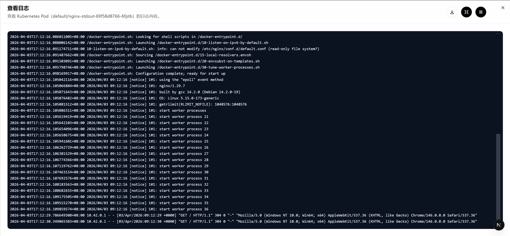
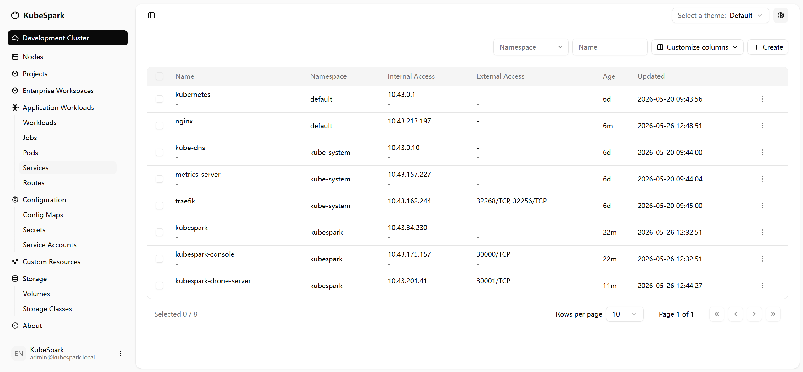

# kubespark-console 控制台（React + Next.js）

kubespark-console 是一个面向 Kubernetes 的可视化管理控制台，聚焦资源 CRUD 与 YAML 协同编辑。  
当前已覆盖命名空间、Pod、Service、Job/CronJob 等常见资源的列表管理、创建/编辑与 YAML 查看能力；并在部分资源提供原生 `kubectl describe` 风格的“详情”查看能力。

## 界面预览





## Kubernetes 部署
```bash
kubectl apply -f deployment/kubespark-rbac.yaml
kubectl apply -f deployment/kubespark-secret.yaml
kubectl apply -f deployment/kubespark-terminal.yaml
kubectl apply -f deployment/kubespark.yaml
kubectl apply -f deployment/kubespark-console.yaml
```

### 2) dev 标签镜像更新说明（重要）

当前处于快速迭代阶段，镜像统一使用 :dev 标签。即使配置了 imagePullPolicy: Always，已运行的 Pod 也不会自动替换为最新镜像。由于 GitHub Actions 会持续推送新镜像，建议你不定期执行以下命令，拉取并应用最新镜像，以便及时体验新功能与修复。
```bash
kubectl rollout restart deployment/kubespark -n kubespark
kubectl rollout restart deployment/kubespark-console -n kubespark
```

## Shell Recommendation

为避免 Windows 终端编码乱码，建议按以下优先级使用：

1. PowerShell 7（推荐）  
2. Git Bash（可选）

- PowerShell 7: `C:\Program Files\PowerShell\7\pwsh.exe`
- Git Bash: `C:\Program Files\Git\bin\bash.exe`

## Getting Started

```bash
npm install
npm run dev
```

Open [http://localhost:3000](http://localhost:3000).

### 自动刷新配置

- 默认：3000ms 自动刷新（3 秒定时轮询）。

### WebSocket 代理说明

- 使用自定义 Node server：`server.js`（用于处理 WebSocket upgrade）。
- 脚本：
  - `npm run dev` -> `node server.js --dev`
  - `npm run start` -> `node server.js --prod`
- 代理规则：
  - HTTP：`/api/kubespark/*`
  - WS：`/api/kubespark-ws/*`

上游地址由 `KUBESPARK_API_BASE` 指定。

## 社区交流

欢迎加入 kubespark-console 用户交流群，反馈问题、交流使用经验与部署实践：

- QQ 群：`1095765093`
